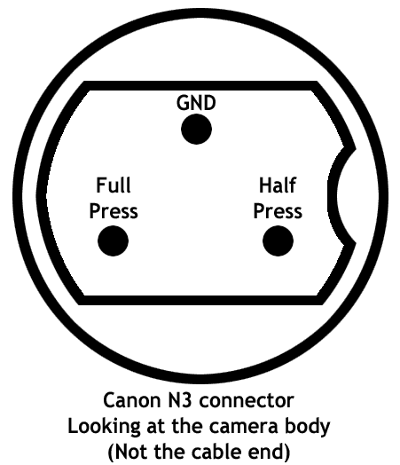

# ScreamBooth

Here is a potato quality video showing how the Scream Booth works.

A sound activated trigger for my Canon DSLR cameras.  I use this for our annual Halloween Party to setup a photo booth.  The photo booth is sound powered, you have to make a loud sharp sound like a scream, clap, stomp, etc.  The sound then trips the camera and the strobe light letting people take pictures of themselves.  Thus the name "Scream Booth"  It's always been a hit at our halloween party, but in 2017, I ran into a problem.

The scream booth was made possible by a company called Trigger Trap, and a product they sold.  The company sold a dongle, one side connected to your camera's remote trigger, the other connected to the headphone port on your smart phone.  You would download a free app onto your smart phone.  The Trigger Trap app had a number of options for triggering a camera, I used the trigger by sound option to run the Scream Booth.  The idea for the Scream Booth came from one of their blog posts.  It looked like so much fun, I setup one for our Halloween party and it was a hit.

In 2017, the hardware dongle failed, whenever it was plugged into the camera, the shutter on the camera would continuously activate.  This was not a good situation.  Around this time smart phone manufacturers had moved away from installing a headphone jack on their smart phones.  Trigger Trap had gone out of business and you couldn't easily buy a replacement dongle.  Frustrated by these technical failures, I didn't setup a photo booth for that year's halloween party.  This... was a mistake :)  After the party, a couple friends suggested that building a DIY sound trigger was a relatively easy electronics task and encouraged me to try and build a replacement.

I've setup this GitHub repository to share the code, the PCB files, photos, etc. so that if you too would like to setup your own sound powered camera trigger, you can use these resources to help get your own setup.

 is correct

## Parts List

* 1 x [Adafruit Trinket M0](https://www.adafruit.com/product/3500)
* 1 x [MAX4466 Microphone](https://www.adafruit.com/product/1063)
* 1 x [Simple Shutter Release Cable](https://www.amazon.com/gp/product/B00C0K2PQU/ref=oh_aui_search_detailpage?ie=UTF8&psc=1)
* 1 x [10K Potentiometer](https://www.adafruit.com/product/562)
* 1 x 1000uF Capacitor
* 3 x 100nF Capacitors
* 1 x [Diode](https://www.digikey.com/product-detail/en/on-semiconductor/1N4148TR/1N4148FSCT-ND/9356376)
* 1 x [Signal Relay](https://www.digikey.com/products/en?keywords=ec2-3nu)
* 1 x NPN Transistor. I used this [2N3094](https://www.digikey.com/product-detail/en/on-semiconductor/2N3904BU/2N3904FS-ND/1413)
* 1 x 1K Resistor
* 1 x 10K Resistor
* 1 x Red LED
* 1 x Green LED

Optional Parts:

* Header Pins
* 5v Power Supply for Trinket & Power Cable.  Perhaps a jack to connect/disconnect the power cable
* Fuse
* On/Off Switch
* Connector for Shutter Release cable to Project box (I used a 3.5mm headphone jack and plug)
* Project Box
* Momentary switch to use as reset button